<style>
body {text-align: justify}
div.black pre {color: #ffffff; background-color: #000000}
</style>


```{r options-chunk, include=FALSE}
knitr::opts_chunk$set(echo = TRUE, 
                      eval = TRUE, 
                      message = FALSE,
                      warning = FALSE, 
                      include = TRUE,
                      fig.path = "Figures/",
                      fig.width = 10, 
                      fig.height = 5)
```

# O que é o Git e o Github ? 

## O Git 

* É um sistema de controle de versão distribuído gratuito e de código aberto projetado para lidar com tudo, de projetos pequenos a muito grandes, com velocidade e eficiência, além de ser fácil de aprender Ele usa recursos como ramificação local barata, áreas de preparação convenientes e vários fluxos de trabalho.

> *Curiosidade: A microsoft migrou o seu sistema de controle de versão interna para o Git com o Github, pois somente para o windows há cerca de 4 mil desenvolvedores em todo mundo e o controle de versão da microsoft não estava dando conta.*

## O Github

* É um conjunto de repositórios publicados no Git e na internet, ou seja, além de o usuário poder fazer o controle de versão na máquina com o GitHub ele também pode fazer esse controle de versão online em um único repositório protegido por usuário e senha, isso é o Github, ou seja, é um local na internet onde estão os diversos repositórios do Git em todo mundo.


# Configurando o git 

O git guarda suas informações em três lugares. 

<div class = "black">
```
  * git config (do sistema como um todo)
  * git config (do usuário)
  * git config (do projeto)
```

Configure informações de usuário para todos os repositórios locais, como o nome e o email que você quer ligado às suas transações de commit.

## Definindo configurações 

### De Usuário

```
git config --global user.name "nome do usuario"

```
### De e-mail


```
git config --global user.email "endereco-de-email"

```

### Do editor

```
git config --global core.editor "nome do editor"

```
## Retornando as configurações

### Do usuário

```
git config user.name

```
### Do e-mail


```
git config user.email
```

### De tudo

```
git config --list
```

# Iniciando um repositório

Com o git já instalado e configurado, agora nós precisamos criar um repositório 
aonde colocaremos os arquivos de nosso projeto.

### Criando uma pasta para o projeto

<div class = "black">
```
mkdir git-course
```

### Entrar na pasta 

<div class = "black">
```
cd git-course
```


Agora queremos que o repositório criado seja parte do ecossistema do git, 
para isso seguiremos com:


```
git init 
```


O git init será responsável por inicializar o repositório e ficar enxergando todas as mudanças 
que ocorrem dentro do repositório.

# O que há dentro do diretório ?

<div class = "black">
```
ls -la

```

## dentro do diretório .git

```
ls 

```

Vemos algumas pastas que são responsáveis por guardar a: 

  * __config__ : Configuração do Repositório.  
  * __HEAD__ :   Branch padrão.     
  * __branches__: Branches existentes do projeto. 
  * __description__:  Descrição das branches.  
  * __hooks__: Catilhos para fazer certas ações. 

Então toda vez que inicializamos um repositório o git cria essas pastas para guardar informações.


# Ciclo de vida dos arquivos. 

O git os arquivos passam por quatros estágios bem definidos.


  * __Untracked__ :  
  * __Unmodified__ :        
  * __Modified__:  
  * __Staged__:    


<center>

</center>


## Untracked

É o momento em que o arquivo acabou de ser adicionado no repositório, mas ainda não foi visto pelo git, ou seja, o git não reconhece em seu repositório em nenhuma versão a existência deste arquivo.

## Unmodified

Depois que um arquivo é adicionado ele passa a ser considerado como não modificado, ou seja, ele já existe no git mas ainda não sofreu modificações

## Modified

Após um arquivo ser reconhecido pelo git podemos então editá-lo e todo arquivo editado passa ao status de modificado

## Staged

Depois do arquivo ser modificado podemos colocá-lo em uma área onde será criada uma versão, a qual é chamada de staged

## Commit


Os arquivos comitados passam ao status de unmodified, pois uma vez que a versão de um arquivo foi criada e comentada nada foi alterado.    


# Primeiro comando


## git status

> Serve pra reportar como está o meu repositório neste momento.

<div class = "black">
```
git status
```
Se não existir nada ainda em seu repositório irá aparecer a seguinte mensagem:

<center>
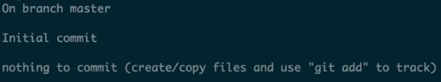
</center>

<br>

  * __On branch master__: significar que você está na branch master
  
  * __Inicial commit__ : ainda não tive nenhum commit 
  
  * __nothing to commit__: não tenho nada para commitar
  
  Como ainda não há arquivos em nosso repositório, iremos criá-lo usando um editor de texto vim.  


<div class = "black">
```
vim Readme.md

```
<center>
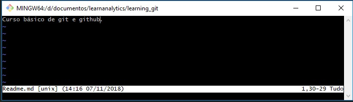
</center>

<br>

  * Criado o arquivo Readme.md criado vamos agora inserir um texto nele.
  * Pressione a tecla i para passarmos ao modo de inserção.  
  * Digite a frase Curso básico de gite github.
  * Pressione ESC para voltar ao modo de comando.
  * Digite :wq e sem seguida pressione o Enter. 


Obs: O comando (:wq) é utilizado para salvar (salve) o arquivo e sair (quit) do Vim.
</br>

Agora podemos verificar novamente o status  

<div class = "black">
```
git status

```

<center>
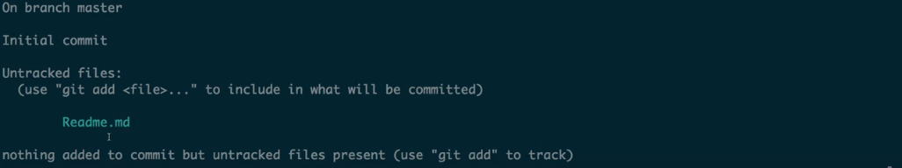
</center>

<br>

> *Observe que o arquivo Readme.md está com seu status em untracked, ou seja, ele acabou de ser criado porém o git ainda não o reconhece, iremos adicioná-lo usando o comando git add [nome do arquivo] e em seguida digitaremos novamente o git status.*


## git add

<div class = "black">
```
git add Readme.md

```

<center>
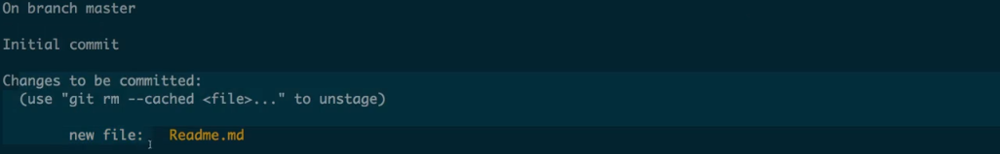
</center>

<br>
Veja, temos um novo arquivo reconhecido pelo git! 
O output indica que este é o momento do staged, agora o arquivo já pode ser commitado e preparado para criarmos uma versão dele.


# Commit nos arquivos

<center>
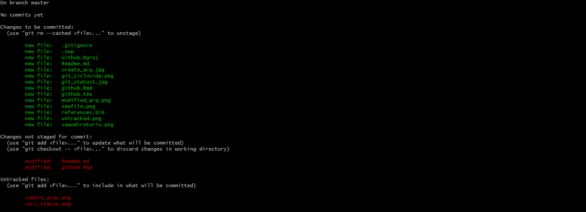
</center>

<br>
Observe que o git nos mostra os arquivos de acordo com o estágio dentro do ciclo de vida do arquivo, e por isso temos os arquivos

* commit_ars.png 
* very_status.png

no primeiro estágio que é untracked, ou seja, ainda não foram reconhecidos pelo git, precisam ser adicionos e comitados. Já os arquivos 

* Readme.md 
* github.Rmd 

são reconhecidos pelo git, porém como foram modificados precisam ser adicionados e commitados.

<center>
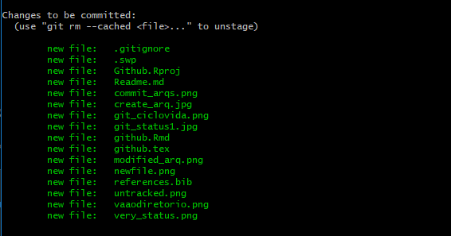
</center>

<br>

> *O comando commit é usado no momento em que você quer avisar o git que ele já pode criar uma image (snapshop,versão) do(s) arquivo(s) que está(ão) no repositório.*


#### commitando o Readme.md 

<div>
```
git commit -m "Add Readme" Readme.md  

```
Obs: No texto do commit é importante escrever o que realmente ocorreu com o arquivo, para que caso tenha que retornar a uma determinada versão você se lembre facilmente da alteração que foi feita, isso contribui em muito para o desenvolvimento de código em equipe.        


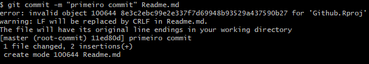


Note que o commit foi criado na [branch master] com a hash 11ed80d e com o seguinte comentário "primeiro comit".
Após o commit de todos os arquivos, sobrou apenas o arquivo github.Rmd


<center>
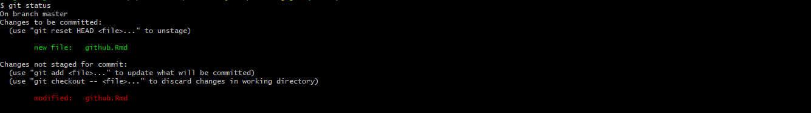
</center>


# Visualizando os logs

Através do comando git log podemos verificar os arquivos que foram versionados. 

```
git logs
```

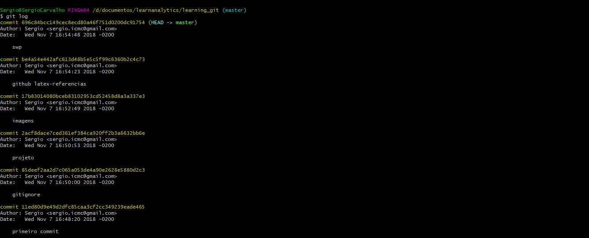

## Filtrando os logs

<div>
```
$ git shortlog --author="sergio"
Sergio (6):
      primeiro commit
      gitignore
      projeto
      imagens
      github latex-referencias
      swp
```      


Uma forma bastante interessante de visualizar os logs é utilizndo o comando git log --graph, observe.


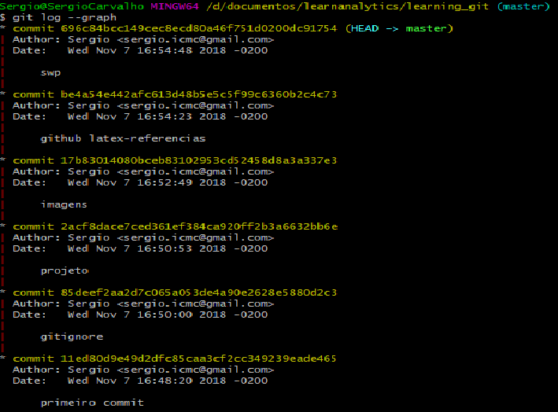

## Usando a hash para ver o commits

```
git show [hash]
```

O comando *git show* seguido pela *hash* de determinado commit nos mostra qual a alteração que houve ao commitar o arquivo.  


# Visualizando o diff


# O Comando diff

> *O comando diff permite a nós visualizarmos as mudanças feitas nos arquivos antes de salvar a versão e fazer o commit.* 


## Exemplo: 

Pelo git bash iremos criar o arquivo Comando_diff.md e trabalhar nele.  

<div>
```
git subl Comando_diff.md 
``` 
</div>

Digite: entendendo o comando diff.


### O que foi mudou ?

<div>
```
git diff
```	
</div>


<center>	
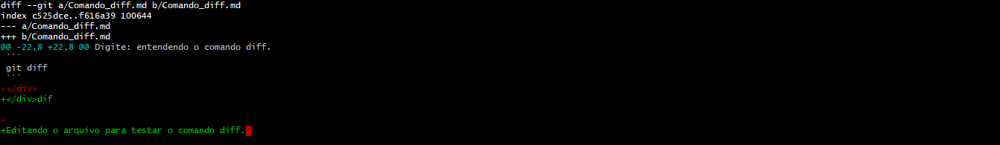 
</center>

<br>
Observe que git coloca um sinal de '+' indicando que houve alguma modificação isso nos ajuda no sentido de que podemos visualizar e revisar as mudanças antes de enivar para que o git salve uma versão, por isso é sempre interesse utilizar o git diff antes de realizar o commit.  

## Opções do git diff

<div>
```
git diff --name-only
```	


Nesta opção o git retorna somente o nome do arquivo modificado.

 
## Git checkout

O git checkout é utilizado para nos ajudar a desfazer coisas, por exemplo, suponha que acabamos de realizar alguma modificação em um arquivo e ai, antes de commitar digitamos o comando git diff, na hipótese de termos feito algo errado ou que apenas não gostamos da modificação realizada podemos resetar o arquivo com o comando **git checkout** que o arquivo voltará ao seu status de conteúdo antes da modificação.   

<div>
```
git diff checkout [nome do arquivo]
```	

# Git reset

O comando git reset tem três variações:

* **git reset --soft**: reset o commit mas deixar o arquivo no staged para ser commitado novamente.
* **git reset --mixed**: reset o commit mas volta o arquivo para antes do unstaged, modified.
* **git reset --hard**:  reset todo o arquivo como se o commit sido feito.

As três formas de uso do git reset, soft, mixed e hard, são acompanhadas da hash que indica que o reset será dado nas modificações posteriores a ela.


# Repositório Remoto (O github)


No github, 

* Crie um repositório com o mesmo nome do nosso repositório local ()
* Em seguida, gere uma chave SSH em nosso computador de trabalho e adicioná-la ao github.   


# Criando um repositório ou obtenha de uma URL existente

Com o Git Bash criamos o repositório *learning_git* em *~/documents/estudos de analytics*.   


```
git init [nome-do-projeto] 
```


> *Apontar git init para um diretório de projeto existente executará a mesma configuração de inicialização mencionada acima, mas com escopo para o diretório do projeto.*

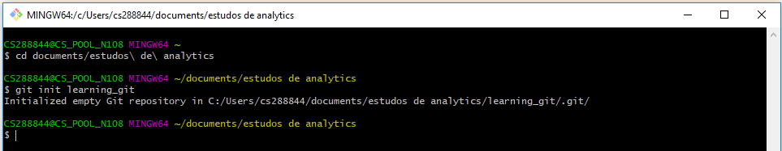

## Clonando um repositório existente: git clone


> *Se um projeto já foi configurado em um repositório central, o comando clone é a maneira mais comum para os usuários obterem um clone de desenvolvimento local. Como git init, a clonagem é geralmente uma operação única. Depois que um desenvolvedor obtiver uma cópia de trabalho, todas as operações de controle de versão serão gerenciadas por meio de seu repositório local.*


```
git clone [repo url]

```

# Suprima o monitoramento

Ignore arquivos e diretórios temporários

* \*.log
* build/
* temp-\*

Um arquivo de texto chamado .gitignore suprime o versionamento acidental de arquivos e diretórios correspondentes aos padrões especificados


```
git ls-files --others --ignored --exclude-standard
```
Lista todos os arquivos ignorados neste projeto

# 3° Passo: Comandos mais usados

## Faça mudanças

Revise edições e crie uma transação de commit


```
git add [arquivo]
```

Faz o snapshot de um arquivo na preparação para versionamento


```
git diff --staged
```
Mostra a diferença entre arquivos preparados e suas últimas versões


```
git reset [arquivo]

```

Retira o arquivo da área de preparação, mas preserva seu conteúdo

 
```
git commit -m "[mensagem descritiva]"

```

Grava o snapshot permanentemente do arquivo no histórico de versão


# Mude e remova os arquivos versionados

Remove o arquivo do diretório de trabalho e o prepara a remoção

 
```
git rm [arquivo]

```

Remove o arquivo do controle de versão mas preserva o arquivo localmente

 
```
git rm --cached [arquivo]

```

Muda o nome do arquivo e o prepara para o commit

 
```
git mv [arquivo-original] [arquivo-renomeado]

```

# Salve fragmentos

Arquive e restaure mudanças incompletas.

Armazena temporariamente todos os arquivos monitorados modificados

 
```
git stash

```

Restaura os arquivos recentes em stash

 
```
git stash pop

```

Lista todos os conjuntos de alterações em stash

 
```
git stash list

```

Descarta os conjuntos de alterações mais recentes em stash

 
```
git stash drop

```

# Mudanças em grupo

## Nomeie uma série de commits e combine os esforços completos

 
```
git branch

```

Lista todos os branches locais no repositório atual

 
```
git branch [nome-do-branch]

```

Cria um novo branch

 
```
git checkout [nome-do-branch]

```

Muda para o branch especificado e atualiza o diretório de trabalho

 
```
git merge [nome-do-branch]

```
Combina o histórico do branch especificado ao branch atual

 
```
git branch -d [nome-do-branch]

```

Exclui o branch especificado


# Revise o histórico
## Navegue e inspecione a evolução dos arquivos do projeto


```
git log --follow [arquivo]

```

Lista o histórico de versões para o branch atual

 
```
git log --follow [arquivo]

```

Lista o histórico de versões para um arquivo, incluindo mudanças de nome

 
```
git diff [primerio-branch]...[segundo-branch]
```

Mostra a diferença de conteúdo entre dois branches

 
```
git show [commit]
```

Retorna mudanças de metadata e conteúdo para o commit especificado

# Desfaça commits

## Apague enganos e crie um histórico substituto

 
```
git reset [commit]
```

Desfaz todos os commits depois de [commit], preservando mudanças locais

 
```
git reset --hard [commit]
```

Descarta todo histórico e mudanças para o commit especificado


# Sincronize mudanças

## Registre um repositório remoto e troque o histórico de versão

 
```
git fetch [nome-remoto]
```

Baixe todo o histórico de um repositório remoto

 
```
git merge [nome-remoto]/[branch]
```

Combina o branch remoto ao branch local atual

 
```
git push [alias] [branch]
```

Envia todos os commits do branch local para o GitHub

 
```
git pull
```

Baixa o histórico e incorpora as mudanças

# Referências


* [Git-Try-Io](http://try.github.io)
* [Learngitbranching”](https://learngitbranching.js.org)
* [Git-SCM](https://git-scm.com/book/en/v2)
* [GitLab](https://lab.github.com/courses)
* [Gitfordummys](https://www.udemy.com/git-e-github-para-iniciantes)
* [Getting Git Right](https://www.atlassian.com/git)

